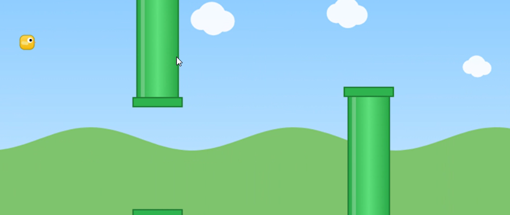

# Flappy Bird (Next.js)

A beautiful, responsive Flappy Bird game built with Next.js and Canvas. Play in your browser—no installs needed!



## Features
- Smooth, responsive gameplay
- Gradient sky, parallax clouds, animated hills, and textured ground
- Glossy pipes with caps and highlights
- Bird with shading, animated wing, and shadow
- Score display and restart button
- Keyboard and touch controls
- Works on desktop and mobile

## How to Play
- **Flap:** Press <kbd>Space</kbd>, <kbd>ArrowUp</kbd>, or tap/click the canvas to make the bird jump.
- **Restart:** After game over, press <kbd>Enter</kbd> or tap/click to play again.

## Getting Started

1. **Install dependencies:**
	```powershell
	pnpm install
	```
2. **Run the development server:**
	```powershell
	pnpm dev
	```
3. Open [http://localhost:3000](http://localhost:3000) in your browser.

## Project Structure
- `src/app/page.tsx` — Main Flappy Bird game logic and rendering
- `src/app/layout.tsx` — App metadata and layout
- `public/` — Place your screenshots or icons here

## Customization
- Tweak colors, bird size, or pipe gap in `src/app/page.tsx`
- Want pixel art, sound, or high scores? Open an issue or PR!

## Credits
- Inspired by the original Flappy Bird by Dong Nguyen
- Built with [Next.js](https://nextjs.org/) and [React](https://react.dev/)

---

Enjoy the game! Star the repo if you like it 🚀